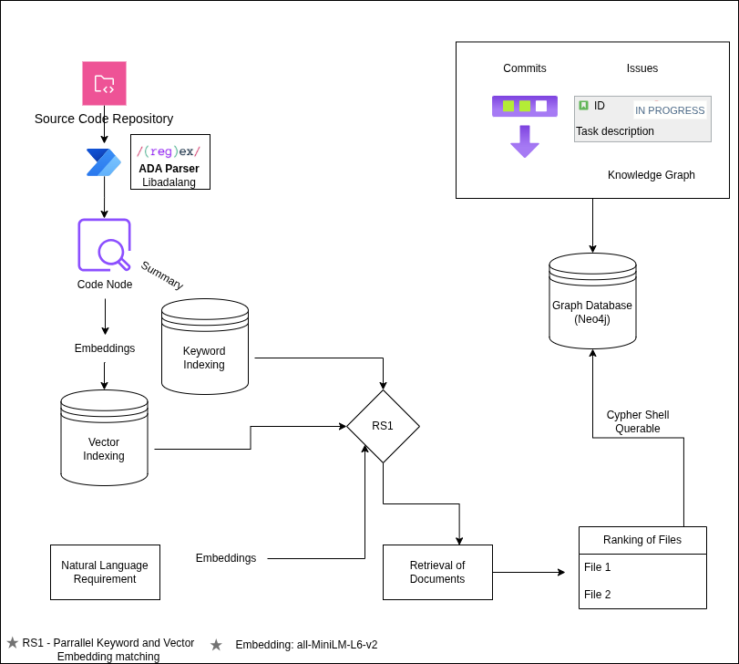

# ADATracer

A requirement-to-code traceability system for large Ada codebases.

**🌐 Website:** [venkatkaushal.github.io/ADATrace](https://venkatkaushal.github.io/ADATrace/)

## Overview

ADATracer connects requirements to Ada program elements, files, and GitHub commits/issues using a hybrid approach that combines static analysis, embeddings, and lexical matching. The system is designed to be deterministic, explainable, and extensible—not a black-box ML pipeline.

### Traceability Flow

```
Requirement
    ↓
[Semantic + Keyword Matching]
    ↓
AdaNode (procedure / function / type)
    ↓
File
    ↓
Commit / Issue
```

## Key Features

- **Batch Analysis** - Process entire requirement sets at once
- **Interactive Exploration** - REPL interface for human-in-the-loop analysis
- **Graph Persistence** - Store traceability relationships in Neo4j
- **Evaluation Framework** - Validate against ground truth with precision/recall metrics
- **Hybrid Scoring** - Combines semantic similarity (70%) and keyword matching (30%)

## Architecture

### Core Components

- **Static Structure** - Extracted using libadalang
- **Semantic Similarity** - Powered by sentence embeddings
- **Lexical Grounding** - Full-file keyword overlap analysis
- **Graph Storage** - Neo4j for relationship persistence

## Architecture


## Repository Structure

### Core Parsing & Modeling

| File | Purpose |
|------|---------|
| `code2graph.py` | Parses Ada source files using libadalang, extracts procedures/functions/types, produces `AdaNode` objects with disk caching |
| `req2nodes.py` | Loads and parses requirements from text files into `RequirementNode` objects |

### Embeddings & Similarity

| File | Purpose |
|------|---------|
| `embeddings.py` | Generates embeddings using sentence-transformers, computes cosine similarity, creates `RELATED_TO` relationships |

### GitHub Integration

| File | Purpose |
|------|---------|
| `github_integration.py` | Fetches issues and commits from GitHub with local caching, extracts commit messages, changed files, and issue references |
| `derive_traceability.py` | Derives deterministic relationships: `CHANGES` (Commit → AdaNode), `IMPACTS` (Issue → AdaNode), `ADDRESSES` (Commit → Issue) |

### Graph Persistence

| File | Purpose |
|------|---------|
| `graph_database.py` | Neo4j persistence layer for nodes (AdaNodes, Requirements, Commits, Issues) and relationships |

### Orchestration

| File | Purpose |
|------|---------|
| `orchestrate.py` | End-to-end batch pipeline that builds the complete traceability graph |
| `no_req_orchestrate.py` | Same as `orchestrate.py` but without requirements (for debugging or partial builds) |

### Interactive Exploration

| File | Purpose |
|------|---------|
| `cli_repr.py` | Interactive CLI (`adatracer>`) with hybrid scoring and commands: `req`, `reqfile`, `show`, `commits`, `issues` |

### Evaluation

| File | Purpose |
|------|---------|
| `evaluate.py` | Evaluates predictions vs ground truth with metrics: Precision, Recall, F1, Recall@K, macro averages |

### Utilities

| File | Purpose |
|------|---------|
| `list_functions.py` | Lists extracted Ada functions/procedures for debugging |
| `constants.py` | Static default values (overridden at runtime by REPL config) |

## Installation

### Prerequisites

- Docker
- Docker Compose
- SSH access (if deploying remotely)

### Build & Start

```bash
# Build the containers
docker compose build

# Start Neo4j
docker compose up -d neo4j
```

## Usage

### Batch Traceability Build

Run the complete pipeline to build the traceability graph:

```bash
docker compose run --rm adatracer python orchestrate.py
```

### Interactive REPL

Launch the interactive exploration interface:

```bash
docker compose run --rm adatracer python cli_repr.py
```

You will be prompted to configure:
- Ada source directory
- Neo4j connection details
- Top-K results for queries

#### REPL Commands

- `req <requirement-text>` - Find related code for a requirement
- `reqfile <path>` - Process requirements from a file
- `show <node-id>` - Display details for a specific node
- `commits <node-id>` - Show commits affecting a node
- `issues <node-id>` - Show issues related to a node

### Evaluation

Validate traceability results against ground truth:

```bash
python evaluate.py \
  --ground-truth ground_truth.json \
  --predictions predictions.json \
  --top-k 10 \
  --output results.json
```

### Neo4j Access (Remote via SSH)

For remote deployments, create an SSH tunnel:

```bash
ssh -L 7474:localhost:7474 -L 7687:localhost:7687 user@server
```

Then access the Neo4j browser at: http://localhost:7474

## Hybrid Scoring Algorithm

ADATracer uses a weighted combination of semantic and lexical matching:

```
combined_score = 0.7 × semantic_similarity + 0.3 × keyword_overlap
```

- **Semantic similarity** - Computed from sentence embeddings (cosine similarity)
- **Keyword overlap** - Calculated from full-file text matching

## Output & Caching

- **Ada nodes** - Cached in `outputs/.../ada_nodes.json` to avoid re-parsing
- **GitHub data** - Issues and commits cached locally (`issues.json`, `commits.json`)
- **Graph relationships** - Persisted in Neo4j for efficient querying

## Graph Relationships

| Relationship | From | To | Description |
|--------------|------|-----|-------------|
| `RELATED_TO` | Requirement | AdaNode | Semantic/keyword similarity match |
| `CHANGES` | Commit | AdaNode | Commit modified the code element |
| `IMPACTS` | Issue | AdaNode | Issue affects the code element |
| `ADDRESSES` | Commit | Issue | Commit resolves/references the issue |

